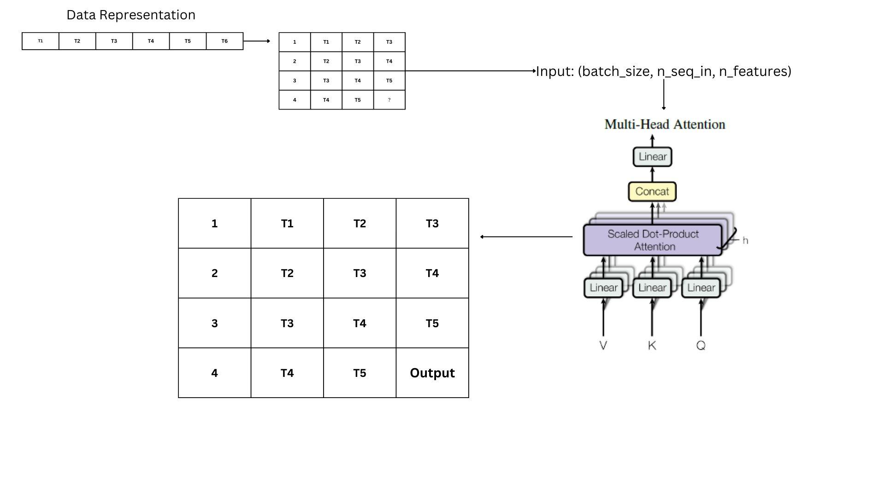
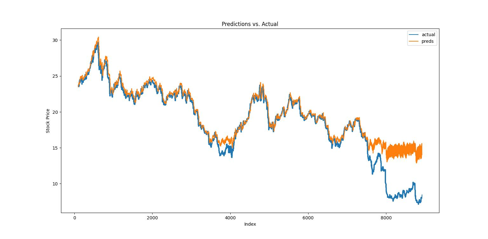

# Transformer-architecture-for-time-series-prediction-using-Pytorch-

 # **Introduction:**
 **Overview**
Predicting stock market behavior represents a serious challenge for financial analysts due to the random nature of stock market features. These features are often unpredictable and difficult to generalize, making accurate modeling of stock market behavior an extremely difficult problem.

The category under which this problem lies is referred to as technical analysis, which involves the interpretation of price actions in the stock market. This type of analysis focuses primarily on determining the likelihood of a trend continuing or reversing. Technical analysis aims to reflect all available information that could affect the behavior of the trend and assumes that prices tend to follow the same past tendencies. 

**Deep Learning perspective**
the technical analysis of stock markets can be seen as a time series problem, where, given a sequence of observations, we aim to predict a fixed-size window of future behaviors based on the trend. A simple solver for this problem can be thought of as computing the linear combination of the input sequence, where a coefficient factor determines the impact of previous time spots at each period. An improved predictor can be constructed by optimizing the predictions of our current model, turning it into an optimization problem on time series data, which is very appropriate for modern deep-learning solvers.

The prediction of our autoregression model can be expressed as:  
**p = β₁ * yₜ₋₁ + β₂ * yₜ₋₂ + β₃ * yₜ₋₃ + … + βₖ * yₜ₋ₖ**
Where:
- **p**: the predicted value.
- **yₜ₋ᵢ**: the value of the time series at the previous time step 𝑡−𝑖.
- **βᵢ**: the coefficient representing the weight of each time step's contribution.


# **Architecture**

The proposed architecture is a hybrid of an encoder block adapted from transformers and 1D convolution layers.


## **Encoder Layer**:
The core of the network is an encoder block that is primarily composed of:
- A multi-head self-attention layer, followed by two convolution layers.
- The multi-head layer creates a contextually aware vector of shape `(sequence_length, num_features)` for each sentence.
- Conv1D layers increase the dimensionality of `num_features`, enabling detection of more complex features in the context-aware vector.
- Normalization, dropout, and residual connection layers are added to:
  - Stabilize backpropagation.
  - Prevent overfitting.
  - Preserve gradient flow to ensure the model learns effectively.

## **Transformers**:
- The transformer block stacks `N` encoder blocks to:
  - Obtain contextual awareness from higher to lower-level features.
- Outputs are passed through mapping layers to:
  - Increase the learnability of the model.
  - Match the outputs to the desired output shape `(examples, output_sequence_length)`.

### **Additional Notes**:
- Input and ground truth sequences are normalized before feedforward to ensure better stability during training.
- After predictions, an inverse transformation is applied to:
  - Revert the normalized predictions to their original scale.
  - Facilitate plotting and computation of relative error, which is used for model performance comparison.

### **Limitations**:
- Due to excessive RAM usage, it wasn’t possible to run feedforward on the full test data locally.
- The `analysis.csv` file for this model was computed using Google Colab.

# **Hyperparameters and Loss Function**

- **batch_size**: `32`
- **epochs**: `25`
- **lr**: `0.001`
- **Loss function**: 
  - Mean Absolute Error (MAE) is used to compute the average of absolute differences between predicted and actual values, making it a straightforward measure of error.
- **Resutls**:  


# **Running the Main Script with Command-Line Flags**
## Running Modes:
* --train: Run the script in training mode. This flag allows you to retrain the model.
Generates model.tbh
* --test: Run the script in testing mode. This flag allows you to evaluate the model on a test dataset.
* --analyze: Run the script in analysis mode. This flag allows you to analyze the performance of the model.
Generates Model-analysis.csv that contains the average error for each entry in the test data 
* --viz: Run the script with visualization. This flag plots how the evaluation of the model improves as the model learns.
Generates a plot in model/visualizations


## Usage:
**To run the main script with desired flags, execute the following command:**

```
python3 main.py [--train] [--test] [--analyze] [--viz] 
```
### **Examples**:

**To train the model and visualize the performance:**
```
python3 main.py --train --viz
```

**To run the Transformer model on an evaluation dataset:**
```
python3 main.py --test
```
